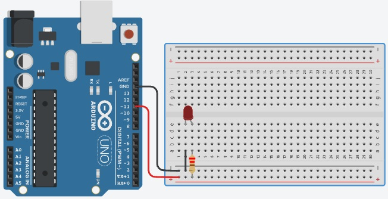

# Projeto Arduíno aumentando o brilho do LED de forma gradativa.

## Contextualização

Neste experimento você irá fazer com que o LED 	conectado na porta digital 11 (PMW) aumente gradativamente o brilho no intervalo de 0 a 255 em passo 5. 

## Lista de componentes:

- 1 – Arduíno UNO R3
- 1 – Um cabo de conexão USB
- 1 – Placa de prototipação (Protoboard)
- 3 – LED
- 3 – Resistor de 220 Ω ohms
- 5 – Jumpers (macho-macho)

## Esquema do projeto

## Projeto no Tinkercad

https://www.tinkercad.com/things/j5TBuu3Zbtj

## Experimentar e pesquisar:

- Pesquisa porque o pino digital 12 é diferente do pino digital 11 PMW?
- Mostre o valor da variável i no monitor serial.
- Altere o passo para utilizar o valor 1.
- Que alterações são necessárias nos blocos para depois de acender no LED no brilho máximo este seja esmaecido ao brilho mínimo no passo 5.
